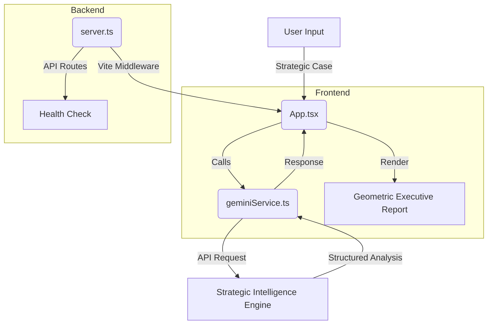

# Strategic Debrief Protocol

An advanced executive decision-making strategist designed to help users make clear, structured, and intelligent life or career decisions.


## Project Structure (Flowchart)



## Directory Structure

```text
/
├── server.ts             # Express server entry point (Full-stack)
├── package.json          # Dependencies & Scripts (tsx dev)
├── vite.config.ts        # Vite configuration
├── src/
│   ├── App.tsx           # Main UI & Logic
│   ├── main.tsx          # React entry point
│   ├── index.css         # Geometric styling & Markdown themes
│   ├── services/
│   │   └── geminiService.ts # AI Integration & System Instructions
│   └── components/       # UI Components
│       └── ui/           # shadcn/ui components
└── components.json       # shadcn configuration
```

## Features
- **Geometric Design**: Brutalist-inspired UI with high-contrast White, Green, and Blue palette.
- **Strategic Intelligence**: McKinsey-style analytical breakdowns.
- **Full-Stack**: Express backend with Vite middleware integration.
- **Animations**: Fluid motion transitions using `motion/react`.

**Developed & Authored by Jayalle Pangilinan**
